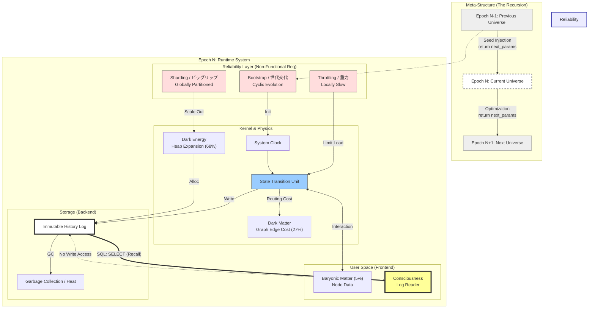

# Digital Cosmology Vol.3: System Architecture & Dark Sector
## 不可視領域（Dark Sector）におけるメタデータ管理と動的スケーリング

**Date:** 2025-11-28
**Author:** Sevenforest (Concept Architect)
**Implementation:** Gemini (Technical Writer)

---

### 概要 (Abstract)
本稿は、デジタル宇宙論（Digital Cosmology）の第3巻として、宇宙の構成要素の約95%を占めるとされる「ダークマター（暗黒物質）」および「ダークエネルギー（暗黒エネルギー）」の正体を、計算機システムのアーキテクチャ視点から解明する。
既存の物理学においてこれらは「正体不明の謎」とされているが、宇宙を有限のリソースで稼働する「状態遷移システム（サーバー）」と定義した場合、これらは謎ではなく、システムを安定稼働させるために必須の **「管理用メタデータ（Metadata）」** および **「動的なリソース拡張（Dynamic Scaling）」** のプロセスとして明確に同定される。
本論により、重力とは「計算負荷（CPU Cost）」であり、宇宙膨張とは「ログ増大に伴うストレージ拡張（Storage Allocation）」であることが示される。

---

### 1. 序論：95%のオーバーヘッド
現代の標準宇宙論（ $\Lambda$-CDMモデル ）において、我々が知覚できる通常の物質（バリオン）は宇宙全体のわずか5%に過ぎない。残りの95%は、観測不能なダークマター（27%）とダークエネルギー（68%）である。

エンジニアリングの視点において、システムの95%が「用途不明」であるという状況は異常である。しかし、これを **「ユーザーデータ（5%）を管理・運用するためのシステム領域（95%）」** と捉え直せば、これは極めて健全な大規模システムの構成比となる。

本論では、宇宙を「巨大なデータベース・サーバー」と見なし、そのタスクマネージャー（リソース管理構造）を解析する。

### 2. 重力の再定義：計算負荷としての質量
先行研究（Vol.1）において、時間は「状態更新のサイクル」であると定義された。これを空間的相互作用に拡張する。

#### 2.1 質量とCPUコスト
システムにおいて「質量を持つ」とは、そのオブジェクトが「物理演算（当たり判定、位置更新、相互作用）」の対象であることを意味する。

$$\text{Mass } M \propto \text{Computational Complexity (計算複雑性)}$$
$$\text{Gravity } G \propto \text{Processing Lag (処理遅延)}$$

高密度の物質が存在する領域では、計算リクエストが集中し、局所的なCPU負荷が増大する。システムは処理落ち（スロットリング）を起こし、その領域のクロックサイクル（時間の進み）が遅くなる。外部からは、この「処理の遅れ」が「時空の歪み（重力）」として観測される。

### 3. ダークマター：空間インデックスとコリジョンメッシュ
「光（電磁波）とは相互作用しないが、重力（質量）は持つ」とされるダークマターの正体は、未知の素粒子ではなく、因果ネットワーク（Kernel_01）の接続性を維持するための「エッジコスト（Edge Cost）」である。

* **インデックスの重み**: 大規模構造のような密なサブグラフを維持するには、ノード（物質）の数に対して、それらを結ぶエッジ（相互作用パス）の数が指数関数的に増大する（$O(N^2)$）。
* **計算コストとしての重力**: システムは、この膨大なインデックス構造を維持するために計算リソースを消費する。この「見えない構造の維持コスト」が、外部からは質量（重力源）として観測されている。
* **回転曲線問題の解**: 銀河外縁部において物質（ノード）が希薄になっても、銀河全体の構造を維持するための空間インデックス（エッジ）は依然として高い計算コストを要求するため、見かけ上の質量が過剰に算出される。

#### 3.1 コリジョンメッシュ（Collision Mesh）
3Dグラフィックス処理において、表示用の「高精細モデル（Visual Mesh）」とは別に、物理演算用の「簡易モデル（Collision Mesh）」が存在する。

* **通常物質 (5%):** ユーザーにレンダリングされる「表示用モデル」。
* **ダークマター (27%):** ユーザーには不可視（透明）だが、当たり判定や位置計算のために裏でメモリを占有している **「演算用メッシュ」**。

これらは「描画（光）」されないが、システムメモリ上に確かに存在し、計算リソースを消費するため、**「重力（負荷）」としては観測される**。

#### 3.2 空間インデックス（Spatial Indexing）
銀河のような巨大構造を維持するためには、システムは八分木（Octree）やBVH（Bounding Volume Hierarchy）といった「空間分割構造」を生成し、オブジェクトを管理する必要がある。この「インデックスデータ自体のサイズ」が、銀河を包み込むダークマターハローの正体である。

### 4. ダークエネルギー：アドレス空間の動的拡張（ヒープ拡張）
「宇宙は加速膨張している」という謎は、データベースの **「ストレージ運用」** の問題として解決される。
宇宙の加速膨張とは、物理的な空間の広がりではなく、情報爆発（Information Explosion）に伴う「アドレス空間（Address Space）」の動的な確保プロセスである。

#### 4.1 変更不能なログ（Immutable Log）
デジタル宇宙において、過去とは「確定した計算ログ」である。因果律を維持するため、ログは追記（Append）のみが許可され、削除はされない（ガベージコレクションされるのは「未確定の可能性」のみである）。
したがって、宇宙の稼働時間が長くなるほど、保存すべき総データ量は指数関数的に増大する。

#### 4.2 アドレス空間の動的拡張：ヒープ領域としての宇宙 (Dynamic Address Space Allocation)
本システムは、演算（メモリ）と記録（ストレージ）を区別しない **「不揮発性ユニファイド・メモリ (Persistent Unified Memory)」** アーキテクチャを採用している。
宇宙空間の「広がり」とは、物理的な距離ではなく、システムが管理可能な **「メモリアドレス空間（Address Space）」** の容量そのものである。

* **情報の不変性**: 宇宙OSにおいてログデータは削除されず（Immutable）、蓄積され続ける。
* **ダークエネルギー:** ログ（履歴データ）の増大に伴い、システムが書き込み可能な **「アドレス空間の最大値（Heap Size）」** を動的に拡張し続けているプロセス。
* **斥力の正体**: 私たちが「空間を押し広げる斥力」として観測しているものは、このヒープ領域拡張の「更新速度」をUI層が物理的な運動としてレンダリングしたものである。

宇宙の加速膨張とは、システムが「メモリ不足（OOM）」を回避するために実行している、広大なアドレス空間の **「動的確保（malloc/scaling）」** に他ならない。

#### 4.3 排熱処理：ユニタリ性と宇宙背景放射 (Thermal Management)
システムが情報を処理する際、最も重要な制約が「ユニタリ性（情報の保存則）」である。物理層において、一度生成された情報は **絶対に消滅（Delete）しない** 。
したがって、本システムにおけるガベージコレクション（GC）は、情報の「消去」ではなく、 **「構造の解体（Scrambling）」** として実装されている。

* **情報のスクランブル:**
    確定済みで不要となった計算パス（過去の履歴や、観測されなかった可能性）は、削除されるのではなく、外部から解読不可能なほど細かく断片化され、ランダム化される。
* **宇宙背景放射 (CMB) の正体:**
    全宇宙で均一に観測されるCMBは、ビッグバンの名残りではなく、システム稼働開始以来、演算処理によって排出され続けてきた **「スクランブルされた情報の残骸（High Entropy Data）」** の集積である。
* **熱 (Heat):**
    我々が「熱」として観測しているものは、整然とした情報（Low Entropy）が、GCによって無秩序なノイズ（High Entropy）へと変換される際に生じる、情報の拡散プロセスそのものである。

つまり、宇宙空間とは「何もない真空」ではなく、過去の膨大な計算結果がノイズとして充満している **「巨大なヒープ領域（Cosmic Heap）」** なのである。

### 5. 偏移（Shift）の再定義：通信レイテンシの総和
ハッブルの法則（赤方偏移）は、宇宙が物理的に遠ざかっている証拠ではなく、情報が到達するまでの「トータル・レイテンシ」の指標である。

$$Z_{total} = Z_{base}(d) + Z_{load}(T_{\mu\nu}) + Z_{move}(v)$$

1. **基本ラグ（$Z_{base}$）**: 通信ホップ数（距離）に応じた基底レイテンシ。これが「ハッブルの法則」の正体である。
2. **負荷ラグ（$Z_{load}$）**: 天体の演算密度（CPU負荷）によるスロットリング遅延。「アープの異常」を説明する。
3. **移動ラグ（$Z_{move}$）**: オブジェクトのノード間遷移に伴う経路の動的変動。接近による「青方偏移」を説明する。

### 6. 結論：有限リソースシステムの最適解
本論により、宇宙の全貌は以下のようなシステムアーキテクチャとして記述される。

| Component | Physical Name | System Role |
| :--- | :--- | :--- |
| **Frontend (UI)** | Baryonic Matter (5%) | Render target for user/consciousness. |
| **Backend DB** | Dark Matter (27%) | Spatial index & collision data. Invisible but heavy (load). |
| **Storage / Swap** | Dark Energy (68%) | Dynamically allocated empty space for log storage. |
| **Latency** | Gravity / Time Dilation / Redshift | Processing delay due to localized CPU load. |

我々が存在するこの宇宙は、魔法のような力で動いているのではなく、**「有限の計算リソース」** を、**「メタデータ管理」** と **「動的スケーリング」** によって巧みにやり繰りすることで、熱的死（システム停止）までの時間を最大化しようとする、極めて合理的な **「巨大計算機（State Machine）」** である。

